<h1 align="center">Easy Notes</h1>

</br>

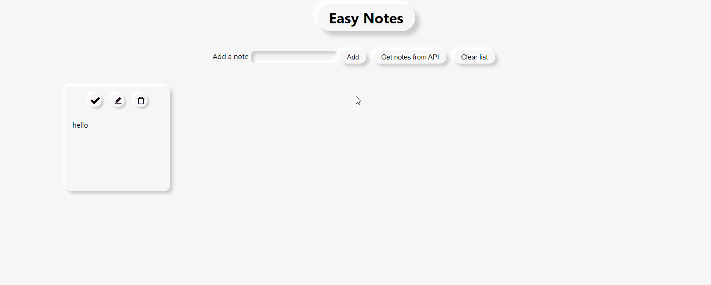

</br>

## Description

#### This app is a note manager in responsive neumorphic design

</br>

---

### <p align="center"><a  href="https://nifty-bhabha-2553a0.netlify.app/">Live Demo</a></p>

---

</br>

## Features

- #### Create new task or note

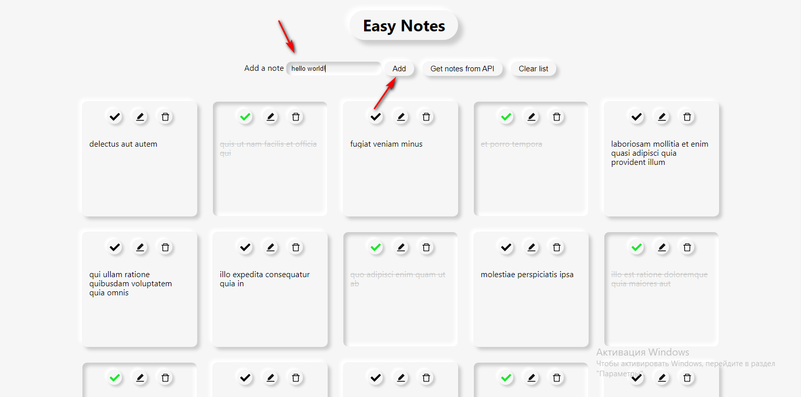

- #### View and edit your tasks

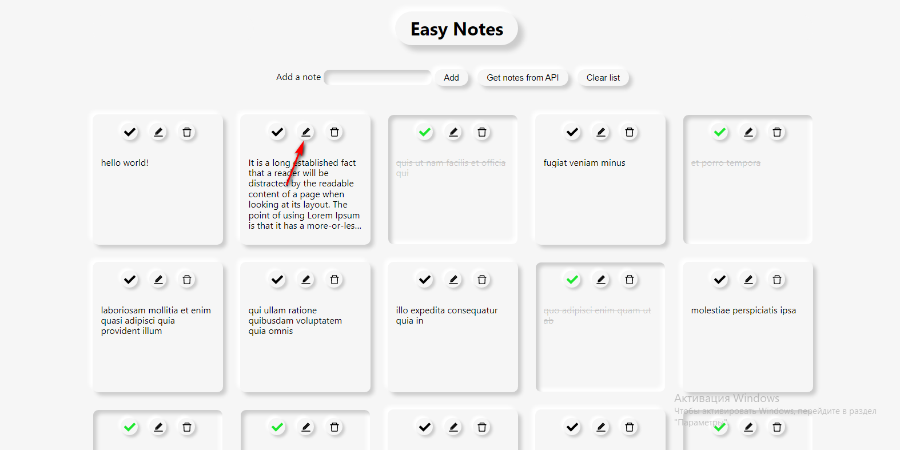

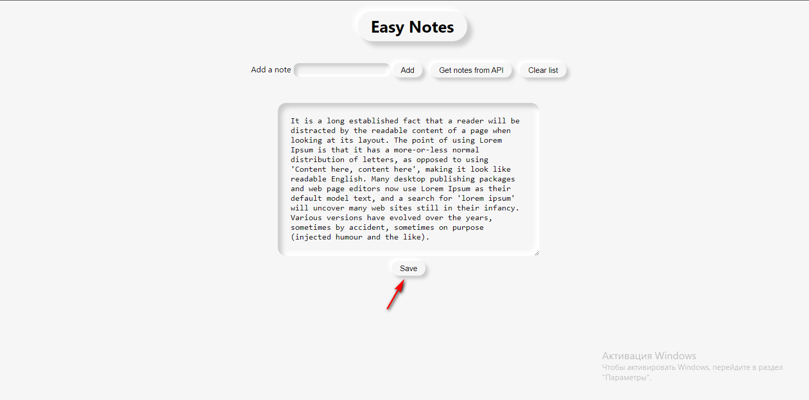

- #### Remove notes

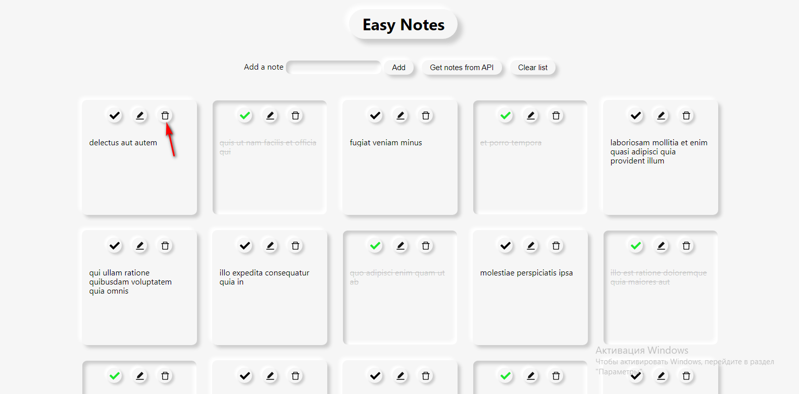

- #### Make your tasks completed

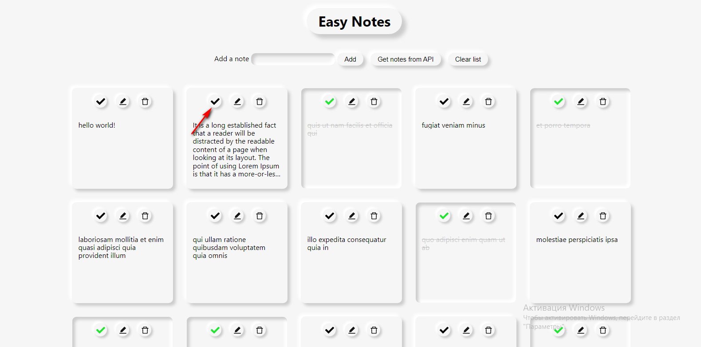

- #### Find notes in a list just by entering text in input

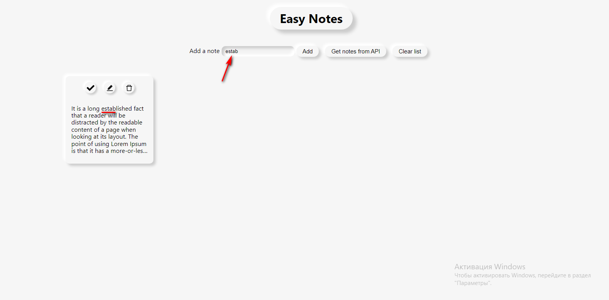

- #### Clear notes list

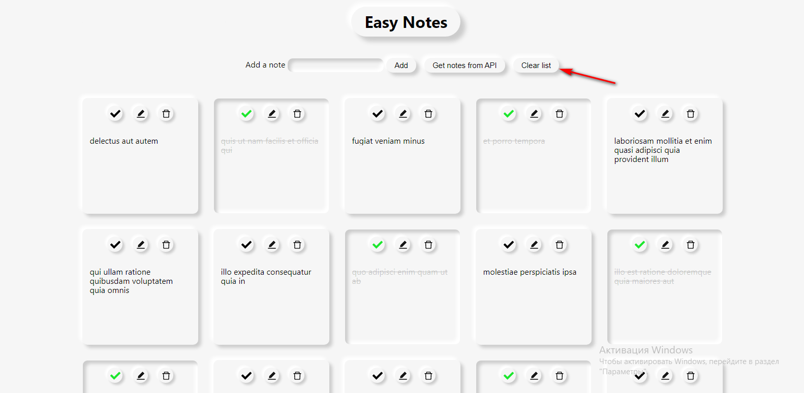

- #### Also you can load the notes from API

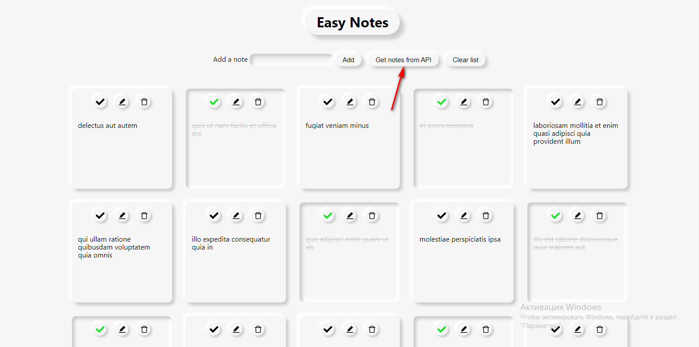

- #### BONUS! You can see hidden current time and date by clicking on the logo!

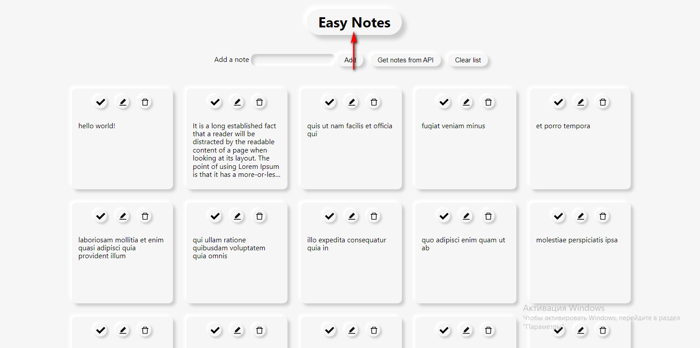

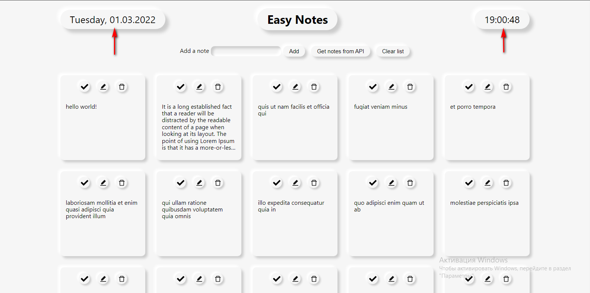

</br>

## Tech

#### Created with **React** and using **SCSS**

</br>

## Setup and Launch

```
$ git clone https://github.com/guryanov-junior/Easy-Notes.git
$ npm install
$ npm start
```

</br>
